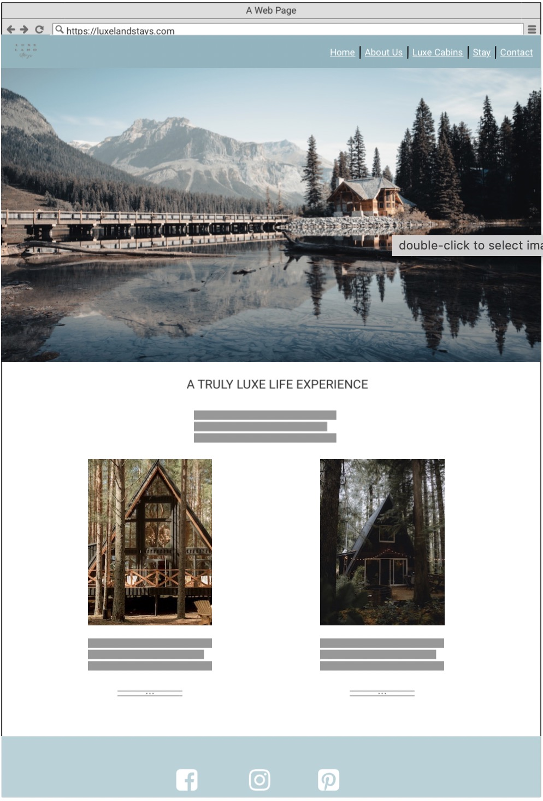
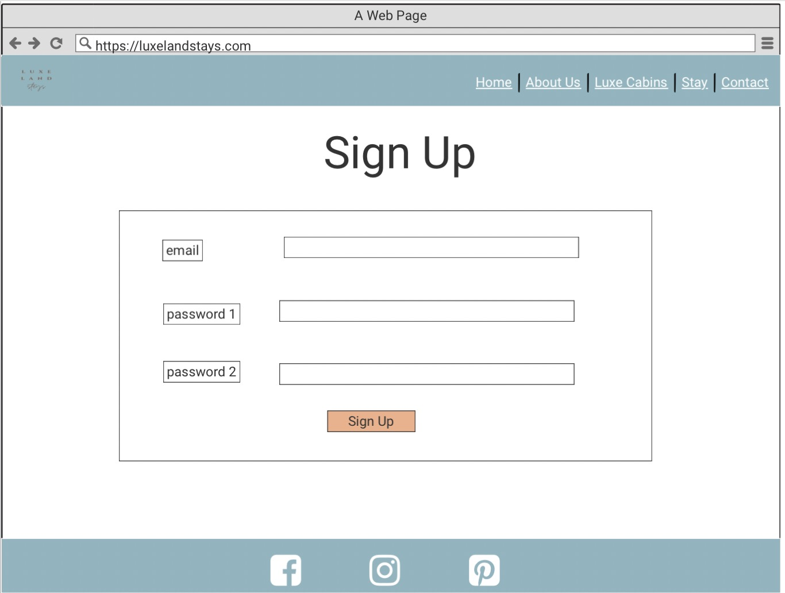

# Room Reservation System

## Introduction
Welcome to my project for a room reservation system. This project is a simple room reservation system, allowing users to choose from two cabins to reserve from. This will use languages such as Django, Python, HTML, CSS and JavaScript.

This project will show the use of CRUD functionality (Create, Read, Update, Delete). The user will be able create, read, update and delete their user profile and table booking.

A live website can be found [here](https://)

# 1. UX

I have always loved to travel, explore and to experience new places. When I do this I enjoy looking at travel websites to find accomodation which meets my needs and looks most appealing. The most common way to do this is to make a reservation for a room on a holiday accomodation website. 

This project will showcase simplicity and ease to reserve a cabin, update a reservation, cancel a reservation, create a personal profile and update a profile.

## 1.1. Strategy

### Project Goals
The main goal of this project is to allow the user to sign up, sign in/out, create/update a user profile and create/update/delete a cabin booking in a simple and effective process.

### User Goals:
First Time Visitor Goals

- As a first-time visitor, I want to reserve a cabin at my chosen date and add notes to my reservation if needed.
- As a first-time visitor, I want to view the cabin types and understand what they have to offer so that I can decide if I would like to make a reservation or not.
- As a first-time visitor, I want to be able to contact the owner of the website with ease.

### Returning Visitor Goals

- As a returning visitor, I want to update my reservation details.
- As a returning visitor, I want to cancel a reservation I have already made.
- As a returning visitor, I want to edit my profile for any future reservation.

Frequent User Goals

- As a frequent user, I want to check to see if there are any new cabins to book or any further facilities added.

### User Expectations:
- The system should have a simple user interface, with the navigation to each section clear and concise.
- The accomodation offering is clear to understand.
- The user interface is easy to navigate.
- The website is responsive on all devices.
- To have the ability to contact the owner site for any enquiries.

### User Stories

Throughout the project I used the GitHub Kanban project board to log all user stories as my project management tool. This helped me to keep focus on the necesarry tasks as I would move them to the "in progress lane" as I'm working on the story. I would then move them to the "done" lane once the story has been completed.

# 1.2. Structure

# 1.3. Skeleton

### Wireframes

Homepage Desktop

Cabin Pages Desktop

Contact Page Desktop

Sign Up Page Desktop

Log In Page Desktop

Log Out Page Desktop

Make Reservation Page Desktop

# 1.4. Surface

# 2. Features

# 3. Technologies Used

- [HTML5](https://en.wikipedia.org/wiki/HTML5)
    - The project uses HyperText Markup Language.
- [CSS3](https://en.wikipedia.org/wiki/CSS)
    - The project uses Cascading Style Sheets.
- [JavaScript](https://en.wikipedia.org/wiki/JavaScript)
    - The project uses JavaScript.
- [Python](https://en.wikipedia.org/wiki/Python_(programming_language))
    - The project uses Python.
- [Boostrap 5](https://getbootstrap.com/)
    - The project uses Bootstrap 5.
- [PostgreSQL](https://www.postgresql.org/)
    - The project uses PostgreSQL as a database.
- [Gitpod](https://www.gitpod.io/)
    - The project uses Gitpod.
- [Chrome](https://www.google.co.uk/chrome/?brand=FKPE&gclid=CjwKCAjwloCSBhAeEiwA3hVo_aLVtE9nXO1mwfa7PzV7psraHUoRQKGmdOj5Bh8E6AFmMlOfebIsqBoCYPYQAvD_BwE&gclsrc=aw.ds)
    - The project uses Chrome to debug and test the source code using HTML5.
- [Balsamiq](https://balsamiq.com/)
    - Balsamiq was used to create the wireframes during the design process.
- [Google Fonts](https://fonts.google.com/)
    - Google fonts were used to import the "Be Vietnam Pro" font into the style.css file which is used on all pages throughout the project.
- [GitHub](https://github.com/)
    - GitHub was used to store the project's code after being pushed from Git.

# 4. Testing

I have not been able to carry out testing for this project using the validator tools for HTML, CCS, Python, Javascript, Accessibility.

# 5. Development Cycle

## Project Checklist

### Install Django and the supporting libraries

- Install Django and Gunicorn. Gunicorn is the server I am using to run Django on Heroku.
- Install support libraries including psycopg2, this is used to connect the PostgreSQL database
- Install Cloudinary libraries, this is a host provider service that stores images
- Create the requirements.txt file. This includes the project's dependencies allowing us to run the project in Heroku.

### Create a new, blank Django Project
- Create a new project
- Create the app
- Add restaurant_booking to the installed apps in settings.py
- Migrate all new changes to the database
- Run the server to test

### Setup project to use Cloudinary and PostgreSQL

### Create new Heroku app
- Sign into Heroku
- Select New
- Select create new app
- Enter a relevant app name
- Select appropriate region
- Select the create app button

### Attach PostgreSQL database
- In Heroku go to resources
- Search for Postgres in the add-ons box
- Select Heroku Postgres
- Submit order form

### Prepare the environment and settings.py file
- Create env.py file
- Add DATABASE_URL with the Postgres URL from Heroku
- Add SECRET_KEY with a randomly generated key
- Add SECRET_KEY and generated key to the config vars in Heroku
- Add if statement to settings.py to prevent the production server from erroring
- Replace insecure key with the environment variable for the SECRET_KEY
- Add Heroku database as the back end
- Migrate changes to new database

### Get static media files stored on Cloudinary
- Create a Cloudinary account
- From the dashboard, copy the API Environment variable
- In the settings.py file create a new environment variable for CLOUDINARY_URL
- Add the CLOUDINARY_URL variable to Heroku
- Add a temporary config var for DISABLE_COLLECTSTATIC
- In settings.py add Cloudinary as an installed app
- Add static and media file variables
- Add templates directory
- Change DIR's key to point to TEMPALTES_DIR
- Add Heroku hostname to allowed hosts
- Create directories for media, static and templates in the project workspace
- Create a Procfile

### Deploy new empty project to Heroku

# 6. Deployment

I used the terminal to deploy my project locally. To do this I had to:

- Create a repository on GitHub.
- Clone the repository on your chosen source code editor (GitPod in my case) using the clone link.
- Open the terminal within GitPod
- Enter "python3 manage.py runserver into the terminal.
- Go to local host address on my web browser.
- All locally saved changes will show up here.

For the final deployment to Heroku, I had to:

- Uncomment the PostgreSQL databse from my settings.py file.
- Set debug = False in my settings.py file.
- Commit and push all files to GitHub
- In Heroku, remove the DISABLE_COLLECTSTATIC config var.
- In the deploy tab, go to the manual deploy sections and click deploy branch.

# 7. End Product

I have not been able to add screenshots of my deployed site.

# 8. Known Bugs

- Some items in the navigation bar don't have a hover teal background to show the user they are on the selected page.
- I have not been able to implement an edit reservation function or cancel reservation function at this time.

# 9. Credits

- All images came from [Pexels](https://www.pexels.com/) and [Unsplash](https://unsplash.com/)
- The website logo was created using [Canva](https://www.canva.com/q/pro/?irgwc=1&utm_medium=affiliate&utm_source=VIP%20Affiliate%20Network_229435&clickId=yf1QNOW%3A0xyIRBs3f2zLu1xeUkGQHERBh393T00&v=1)

